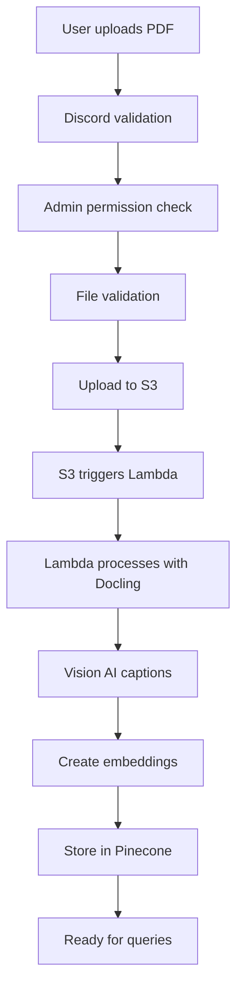
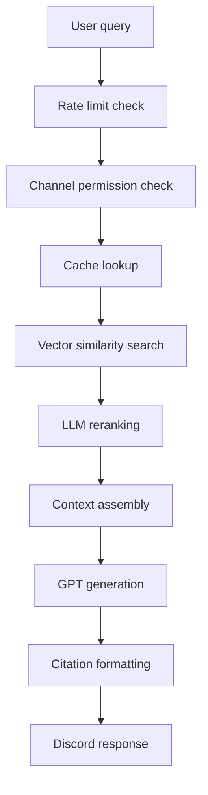
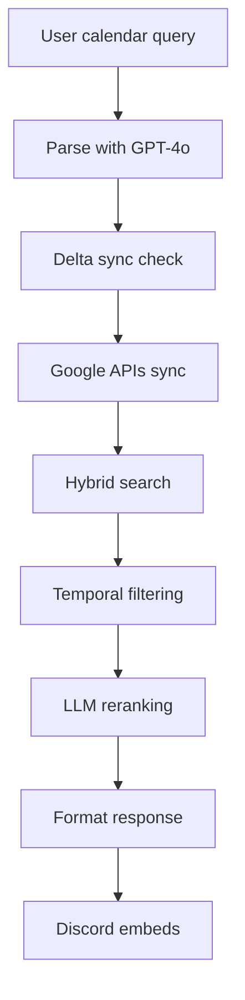

# Discord Academic Jarvis

A sophisticated multi-tenant Discord bot designed for academic environments, providing AI-powered document analysis and intelligent calendar management. Built with modern AI/ML technologies and cloud infrastructure for scalable, production-ready deployment.

## 🎯 Project Overview

This project is a comprehensive academic assistant bot that integrates multiple AI services to help students and faculty with document management and calendar organization. It demonstrates advanced software engineering practices with distributed systems, AI integration, and modern DevOps practices.

**⚠️ Status**: This is a portfolio project showcasing modern AI/ML and cloud architecture. It has not been deployed to production due to ongoing cost and maintenance considerations.

## 🏗️ System Architecture

### Core Technologies

- **Backend**: Python 3.10+ with asyncio for concurrent processing
- **Discord Integration**: discord.py v2.5.2 with slash commands
- **AI/ML Stack**: 
  - OpenAI GPT-4o-mini for text generation and query parsing
  - OpenAI text-embedding-3-large for semantic search
  - Langchain framework for AI orchestration
- **Vector Database**: Pinecone for semantic document search
- **Database**: Supabase (PostgreSQL) for rate limiting and usage tracking
- **Cloud Storage**: AWS S3 for document storage
- **Document Processing**: Docling + AWS Lambda for serverless PDF ingestion
- **External APIs**: Google Calendar & Tasks APIs for calendar integration

### Multi-Tenant Architecture

The system supports multiple Discord servers (tenants) with isolated data and configurable permissions:

```
Tenant (Discord Server)
├── Category-based Permissions
│   ├── Courses: RAG + Calendar
│   ├── Events: Calendar only
│   └── Study Rooms: RAG + Calendar
├── Channel-specific Overrides
├── Isolated Data Storage
└── Dedicated Vector Namespaces
```

## 🚀 Key Features

### 1. RAG (Retrieval-Augmented Generation) System

**Purpose**: Intelligent document Q&A system for academic materials

**Flow**:
```
Document Upload → S3 Storage → Lambda Processing → Vector Store → Query Ready
```

**Components**:
- **Document Ingestion**: Multi-format support (PDF, DOCX, TXT, MD)
- **Advanced Processing**: Docling-based extraction with table/image understanding
- **Vision AI**: OpenAI Vision API for chart and diagram captioning
- **Semantic Search**: Pinecone vector store with hybrid search
- **Smart Chunking**: Page-based chunks with precise citation anchors
- **LLM Reranking**: GPT-4o-mini for relevance optimization

**External Integrations**:
- **AWS S3**: Raw document storage and processing triggers
- **AWS Lambda**: Serverless document processing pipeline
- **Pinecone**: Vector database for semantic similarity search
- **OpenAI**: Text embeddings and GPT completion API
- **Supabase**: Rate limiting and usage analytics

### 2. Calendar & Task Management

**Purpose**: Natural language calendar queries and task management

**Flow**:
```
Query → Parse Intent → Sync APIs → Vector Search → LLM Rerank → Formatted Response
```

**Components**:
- **Query Parser**: GPT-4o-mini powered natural language understanding
- **Delta Sync**: Efficient incremental Google API synchronization
- **Hybrid Search**: Combined temporal and semantic filtering
- **Smart Caching**: Reduced API calls with intelligent cache invalidation

**External Integrations**:
- **Google Calendar API**: Event synchronization and search
- **Google Tasks API**: Task management and due date tracking
- **Pinecone**: Calendar event and task vector search
- **OpenAI**: Natural language query parsing and response generation

### 3. Advanced Caching & Performance

**Multi-layer Caching System**:
- **Response Cache**: Full response caching for repeated queries
- **Retrieval Cache**: Vector search result caching
- **Context Cache**: LLM context caching for cost optimization
- **Embedding Cache**: OpenAI embedding result caching

**Performance Optimizations**:
- Parallel processing for independent operations
- Connection pooling for database operations
- Smart sync frequency management
- Efficient delta synchronization

### 4. Infrastructure

**Rate Limiting**:
- Per-user daily limits with timezone-aware resets
- Global server limits for resource protection
- Supabase-backed with PostgreSQL functions

**Access Control**:
- Role-based permissions for file uploads
- Category-based feature permissions
- Channel-level configuration overrides

**Monitoring & Observability**:
- Comprehensive logging with structured output
- Usage and cost tracking
- Performance metrics collection

## 🔄 System Flows

### Document Upload & Processing Flow



### RAG Query Flow



### Calendar Query Flow



## 🛠️ External Service Integrations

### AWS Services
- **S3**: Document storage with event triggers
- **Lambda**: Serverless document processing
- **ECR**: Container registry for Lambda deployments
- **IAM**: Access control and service permissions

### AI/ML Services
- **OpenAI API**: 
  - GPT-4o-mini for text generation and parsing
  - text-embedding-3-large for semantic embeddings
  - Vision API for image/chart understanding
- **Pinecone**: Managed vector database with hybrid search capabilities

### Google APIs
- **Google Calendar API**: Event synchronization and management
- **Google Tasks API**: Task and deadline management
- **OAuth 2.0**: Secure authentication flow

### Database & Storage
- **Supabase**: PostgreSQL-as-a-Service for rate limiting and analytics
- **Discord API**: Slash commands, embeds, and permission management

## 📁 Project Structure

```
discord-academic-jarvis/
├── main_bot.py                 # Discord bot entry point
├── settings.py                 # Configuration management
├── tenants.json               # Multi-tenant configuration
├── requirements.txt           # Python dependencies
├── dockerfile                 # Lambda container definition
├── deploy-lambda.sh          # AWS deployment script
│
├── rag_module/               # RAG system components
│   ├── rag_handler_optimized.py    # Main RAG logic
│   ├── rag_semantic.py             # Vector search
│   ├── ingest_pipeline.py          # Document processing
│   ├── lambda_entrypoint.py        # AWS Lambda handler
│   ├── pdfingestor.py              # Docling-based PDF processing
│   ├── vision_captioner.py         # Image understanding
│   ├── rate_limiter.py             # Usage tracking
│   └── rag_cache.py                # Multi-layer caching
│
├── calendar_module/          # Calendar system components
│   ├── calendar_handler.py         # Main calendar logic
│   ├── query_parser.py             # NLP query understanding
│   ├── sync.py                     # Google API synchronization
│   ├── delta_sync.py               # Efficient incremental sync
│   └── sync_cache.py               # Sync optimization
│
├── utils/                    # Shared utilities
│   ├── vector_store.py             # Pinecone integration
│   ├── hybrid_search_utils.py      # Advanced search algorithms
│   ├── channel_discovery.py        # Dynamic permissions
│   ├── reranker_rag.py             # LLM reranking for RAG
│   └── reranker_calendar.py        # LLM reranking for calendar
│
├── sql/                      # Database schema
│   └── rate_limiting_schema_final.sql
│
└── tests/                    # Comprehensive test suite
    ├── unit tests
    └── integration/          # Real API integration tests
```

## 🔧 Configuration

### Environment Variables
```bash
# Discord
DISCORD_TOKEN=your_discord_bot_token

# AI Services
OPENAI_API_KEY=your_openai_api_key
PINECONE_API_KEY=your_pinecone_api_key

# Database
SUPABASE_URL=your_supabase_project_url
SUPABASE_API_KEY=your_supabase_api_key

# AWS
AWS_ACCESS_KEY_ID=your_aws_access_key
AWS_SECRET_ACCESS_KEY=your_aws_secret_key
AWS_REGION_NAME=ca-central-1
```

### Multi-Tenant Configuration (tenants.json)
```json
{
  "discord_server_id": {
    "name": "Academic Server",
    "admin_role_id": 123456789,
    "calendar_id": "your_google_calendar_id",
    "tasklist_id": "your_google_tasks_id",
    "index_rag": "rag-server-index",
    "index_calendar": "calendar-hybrid",
    "category_permissions": {
      "category_id": {
        "name": "Courses",
        "features": ["rag", "calendar"]
      }
    }
  }
}
```

## 🎯 Demonstration Use Cases

1. **Document Q&A**: Upload course materials and ask specific questions
2. **Calendar Intelligence**: Natural language calendar queries
3. **Multi-tenant Isolation**: Different servers with isolated data
4. **Permission Management**: Role-based access control
5. **Performance Optimization**: Caching and rate limiting

## 📊 Performance Metrics

- **Response Time**: 50-80% improvement with caching
- **Concurrent Handling**: 30-40% better performance
- **Cost Optimization**: Intelligent caching reduces API costs

## 📈 Future Enhancements

- [ ] Production deployment on cloud infrastructure
- [ ] Advanced analytics dashboard
- [ ] Multi-language support
- [ ] Enhanced document type support
- [ ] Real-time collaboration features

## 📄 License

This project is licensed under the MIT License - see the LICENSE file for details.

## 👨‍💻 Author

**Vasilis Christopoulos**

This project demonstrates:
- Modern Python development with async/await patterns
- AI/ML integration with vector databases and language models
- Cloud architecture with AWS services
- Multi-tenant system design
- DevOps practices with containerization and CI/CD
- RESTful API integration and webhooks
- Database design and optimization
- Performance engineering and caching strategies

---

*This is a portfolio project showcasing modern AI/ML engineering and cloud architecture. While fully functional, it has not been deployed to production due to cost and maintenance considerations.*
